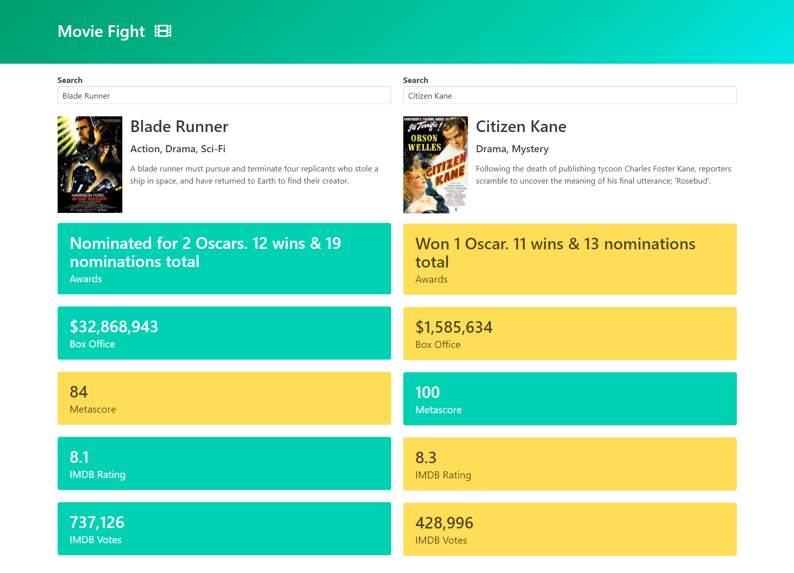

# **About:**

Movie Fight is a simple JavaScript app to compare two movies and pick the best. 

## **Project Focus:**

This project focuses on using the OMDB API and parseing the values returned from the API into a readable format to find the best movie. 
The project also focuses on writing reusable code such as the debounce function in util.js to prevent the API being spammed with requests when searching and returning results.
Autocomplete.js also focuses on writing reusable code to return results from any API to a drop down list which is then handled in index.js

